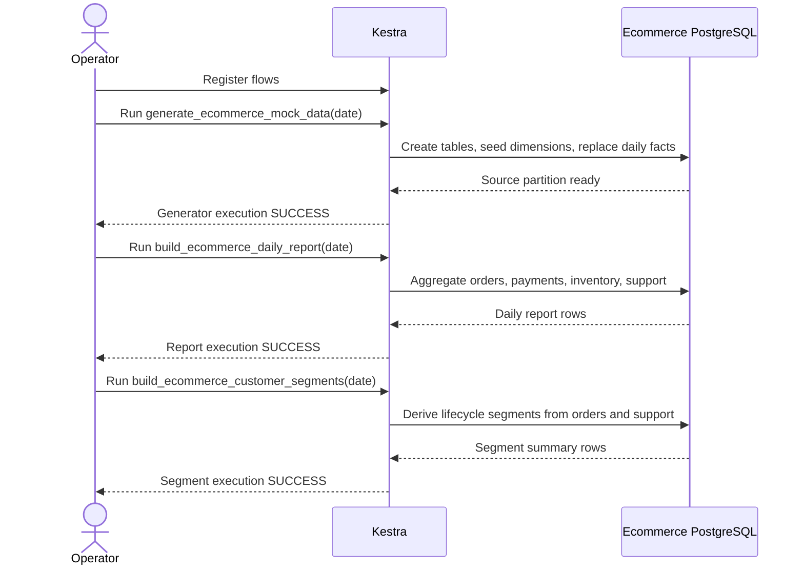

# kestra-playground

Kestra deployment playground for ecommerce batch workflows. The repository keeps a small Python
package scaffold, but the primary assets are Kestra flows, local runtime scripts, Terraform, and
Kubernetes manifests.

## Requirements

- Python 3.12 or newer
- `uv`
- Nix with flakes for the full infrastructure toolchain
- Apple container for the primary local runtime, or Docker Compose as a fallback

## Quick Start

```bash
uv sync --dev
uv run python -m kestra_playground
uv run pytest
```

## Kestra Workloads

Three mock ecommerce flows live under `kestra/flows/`:

- `generate_ecommerce_mock_data` creates product, customer, order, payment, inventory, and support
  ticket data in PostgreSQL.
- `build_ecommerce_daily_report` writes and fetches daily operational metrics from that data.
- `build_ecommerce_customer_segments` writes and fetches a customer lifecycle segment snapshot from
  the generated order and support activity.

The batch relationship is intentionally linear: generate the partition first, then build derived
outputs for the same business date.



All three flows use `ENV_BATCH_DB_URL`, `ENV_BATCH_DB_USERNAME`, and `ENV_BATCH_DB_PASSWORD` so
local and GCP database connection values can be switched by environment file, Secret Manager, or
Kubernetes Secret.

The generated ecommerce data is tracked in `kestra/fixtures/ecommerce/`. The generator flow embeds
those SQL fixtures into PostgreSQL tasks, and the test suite checks that the deployed flow SQL stays
in sync with the committed fixture files.

Current Kestra OSS requires Basic Auth. Local defaults are in `local/docker/.env.example`; the GCP
Terraform roots generate/store runtime credentials in Secret Manager. The GCE roots read Basic Auth
directly from Secret Manager at startup, and the GKE apply helper renders the Kubernetes Secret from
GKE-specific Secret Manager entries.

## Local Kestra

Apple container path:

```bash
cp kestra/config/envs/local.env.example kestra/config/envs/local.env
task kestra:local:apple:start
task kestra:flows:register
task kestra:flows:generate
task kestra:flows:report
task kestra:flows:segments
task kestra:local:apple:stop
```

Docker Compose fallback:

```bash
cp local/docker/.env.example local/docker/.env
task kestra:local:docker:start
task kestra:flows:register
task kestra:flows:generate
task kestra:flows:report
task kestra:flows:segments
task kestra:local:docker:stop
```

Kestra UI defaults to `http://localhost:8080`.

Flow helper scripts can load credentials, URL settings, and default batch date settings from an env
file:

```bash
KESTRA_ENV_FILE=kestra/config/envs/local.env scripts/register-flows.sh
KESTRA_ENV_FILE=local/docker/.env scripts/register-flows.sh
```

The `task kestra:flows:*` commands use `KESTRA_ENV_FILE` when provided, otherwise they prefer
`local/docker/.env` and fall back to `kestra/config/envs/local.env`.

Registering/running flows against an authenticated endpoint. If a business date is not provided,
the helper scripts default to the current date in `Asia/Tokyo`; set `BUSINESS_DATE_TZ` to override
that default timezone. Explicit dates must use `YYYY-MM-DD`.

```bash
export KESTRA_BASIC_AUTH_USERNAME=...
export KESTRA_BASIC_AUTH_PASSWORD=...
scripts/register-flows.sh http://34.84.21.87:8080
scripts/run-flow.sh generate_ecommerce_mock_data 2026-06-25 http://34.84.21.87:8080
scripts/run-flow.sh build_ecommerce_daily_report 2026-06-25 http://34.84.21.87:8080
scripts/run-flow.sh build_ecommerce_customer_segments 2026-06-25 http://34.84.21.87:8080
```

## GCP Deployment Shapes

Terraform roots are split by phase:

- `infra/terraform/bootstrap-project`: creates a new GCP project and enables required APIs.
- `infra/terraform/github-actions`: creates the GitHub OIDC provider and deploy service account
  used by the push/manual/cron workflow.
- `infra/terraform/gce-single`: one GCE VM running Kestra and PostgreSQL through Docker Compose,
  with DB connection values loaded from Secret Manager.
- `infra/terraform/gce-cluster`: multiple GCE VMs running separated Kestra components against shared
  Cloud SQL and GCS.
- `infra/terraform/gke-dev`: GKE Autopilot, Cloud SQL, GCS, and Workload Identity inputs for the
  Kubernetes manifests.

System shape, at a high level:

- One workload contract: the same Kestra flows and runtime image are used locally, on GCE, and on
  GKE.
- One release artifact: GitHub Actions builds the Kestra runtime image and publishes it to Artifact
  Registry with a commit tag plus `latest`.
- Three live HTTPS targets: single-VM Docker Compose, GCE component cluster, and GKE Autopilot each
  have their own subdomain under `example.com`.
- Terraform owns cloud infrastructure, DNS records, Secret Manager entries, load balancers, and
  managed data services. Kustomize owns Kubernetes workload shape.
- Secret values stay outside git; local env files, Secret Manager, GitHub Actions secrets, and
  `kinko` provide runtime values.

The GCE cluster root runs Cloud SQL Proxy as a Docker Compose service, so Kestra uses
`cloud-sql-proxy:5432`. The GKE manifests run Cloud SQL Proxy as a sidecar in each Pod, so those
JDBC URLs use `127.0.0.1:5432`.

Example bootstrap:

```bash
cd infra/terraform/bootstrap-project
tofu init
tofu apply \
  -var='project_id=kestra-playground-dev-<unique-suffix>' \
  -var='billing_account=XXXXXX-XXXXXX-XXXXXX' \
  -var='org_id=123456789012'
```

The commands use OpenTofu from the Nix shell; the files are Terraform-compatible.

Set the live development project through `PROJECT_ID` or `GCP_PROJECT_ID`; do not commit real
project IDs.

Kestra runtime images are published to Artifact Registry:

```text
<region>-docker.pkg.dev/<project-id>/kestra-playground/kestra-runtime
```

The runtime image extends `kestra/kestra:latest` and bakes in `kestra/flows/`,
`kestra/fixtures/`, `kestra/config/`, and the Python batch source under `src/`. The deployment
workflow builds and pushes a commit-SHA tag plus `latest`, then passes the SHA-tagged image to
Terraform through `KESTRA_IMAGE`. The GCE roots use that image in Docker Compose; the GKE apply
helper applies the same image through Kustomize before `kubectl apply`.

Live dev tfvars and backend config are generated under `infra/live/dev/` and ignored by git. They
contain environment-specific project, domain, Cloudflare zone, and state bucket values. Keep those
values in `kinko` locally, or in GitHub repository variables/secrets for CI:

```bash
kinko exec --env PROJECT_ID,LIVE_DOMAIN_NAME,CLOUDFLARE_ZONE_ID,TOFU_STATE_BUCKET,CLOUDFLARE_API_TOKEN -- task kestra:live:deploy
kinko exec --env PROJECT_ID,LIVE_DOMAIN_NAME -- task kestra:live:verify
kinko exec --env PROJECT_ID,LIVE_DOMAIN_NAME -- task kestra:live:run-batch
```

Limit a command to one environment with `TARGET_ENVIRONMENT`:

```bash
TARGET_ENVIRONMENT=k8s task kestra:live:run-batch
TARGET_ENVIRONMENT=gce-container BUSINESS_DATE=2026-06-25 task kestra:live:run-batch
```

GitHub Actions deploys on push to `main`, supports manual dispatch for selected environments, and
runs the ecommerce batch on a daily cron. The workflow uses GitHub OIDC for Google Cloud auth and
expects these repository secrets:

- `GCP_WORKLOAD_IDENTITY_PROVIDER`
- `GCP_SERVICE_ACCOUNT`
- `CLOUDFLARE_API_TOKEN`
- `CLOUDFLARE_ZONE_ID`

It also expects repository variables for the live project, domain, state bucket, image repository,
and optional environment URL.

Live Terraform state uses a GCS bucket provided through generated backend config. The live roots use
per-root prefixes so GitHub Actions can deploy from a fresh checkout without recreating existing
resources.

## Operations Flow

The normal operating path is:

1. Change flows, fixtures, app source, Terraform, Kubernetes manifests, or docs.
2. Run local validation through `task ci` and targeted infrastructure checks.
3. Push to `main`; GitHub Actions builds and publishes the runtime image.
4. Deploy the selected live targets with the SHA-tagged image.
5. Verify HTTPS readiness and register the checked-in flows.
6. Run the batch sequence for a business date: generate data, build the report, then build customer
   segments.
7. For GKE, check the OpenTelemetry Collector when trace-level evidence is needed.

Manual operations use the same scripts as CI:

```bash
kinko exec --env PROJECT_ID,LIVE_DOMAIN_NAME,CLOUDFLARE_ZONE_ID,TOFU_STATE_BUCKET,CLOUDFLARE_API_TOKEN -- task kestra:live:deploy
kinko exec --env PROJECT_ID,LIVE_DOMAIN_NAME -- task kestra:live:verify
kinko exec --env PROJECT_ID,LIVE_DOMAIN_NAME -- task kestra:live:run-batch
```

## HTTPS Domains

The GCE single-VM, GCE cluster, and GKE dev Terraform roots support HTTPS domain configuration.
The Cloudflare-backed development hostnames are derived from generated live config:

- GKE: `https://k8s.example.com`
- GCE clustered container environment: `https://gce-container.example.com`
- GCE single VM Docker Compose environment: `https://gce-compose.example.com`

Start from the checked-in example variables for the root you are applying:

```bash
cp infra/terraform/gce-cluster/terraform.tfvars.example infra/terraform/gce-cluster/terraform.tfvars
```

Then set `domain_name` plus an environment subdomain and apply:

```bash
tofu apply \
  -var='project_id=<project-id>' \
  -var='domain_name=example.com' \
  -var='subdomain=gce-container' \
  -var='dns_provider=cloudflare' \
  -var='cloudflare_zone_id=<cloudflare-zone-id>'
```

When `dns_provider=cloudflare`, set `CLOUDFLARE_API_TOKEN` in the environment. In this workspace,
the token and live DNS values are stored in `kinko`, so Terraform can be run with:

```bash
kinko exec --env CLOUDFLARE_API_TOKEN,CLOUDFLARE_ZONE_ID,LIVE_DOMAIN_NAME -- tofu apply ...
```

When `dns_provider=google` and `create_dns_zone=true`, the root creates a Cloud DNS managed zone and outputs
`dns_name_servers`; delegate the parent domain to those name servers at the registrar. When using an
existing Cloud DNS zone, set `create_dns_zone=false` and `dns_zone_name=<zone-name>`.

After DNS record propagation, Google-managed certificates can take several minutes to become active.
The GKE root reserves the static ingress IP and creates the Cloudflare A record; the dev Kubernetes
overlay contains the matching `k8s.example.com` host and `kestra-dev-ingress` static IP name.

## Kubernetes

Kubernetes manifests are Kustomize-based:

```bash
kustomize build k8s/overlays/dev
scripts/apply-gke-dev.sh
```

The GKE dev overlay includes an in-cluster OpenTelemetry Collector at
`otel-collector.kestra-dev.svc.cluster.local` with OTLP/gRPC on `4317` and OTLP/HTTP on `4318`.
Kestra's Kubernetes `application.yaml` enables Micronaut OpenTelemetry and Kestra flow traces by
default, exporting traces, metrics, and logs to `http://otel-collector:4317`.

Each Kestra component sets a distinct `OTEL_SERVICE_NAME` (`kestra-webserver`, `kestra-executor`,
`kestra-scheduler`, `kestra-indexer`, and `kestra-worker`) plus resource attributes for the
namespace, pod, environment, and Kestra component. Batch flow tasks are split into granular SQL
steps so OTEL traces expose auditable spans for purging, inserts, summaries, and fetches.

After applying GKE, verify telemetry is being received by checking the collector rollout and logs:

```bash
kubectl -n kestra-dev rollout status deployment/otel-collector
kubectl -n kestra-dev logs deployment/otel-collector --tail=200
```

Collector spans include `kestra.executionId`, `kestra.flowId`, and `kestra.uid`. The `kestra.uid`
value maps to the task-run ID returned by the Kestra execution API, which lets operators correlate
collector spans back to specific granular batch tasks.

Apply the live GKE overlay with Terraform outputs without writing real secrets into the repository:

```bash
task k8s:apply:dev
```

For the live GKE environment, Kestra Basic Auth is stored in Secret Manager as
`kestra-dev-gke-kestra-basic-auth-username` and
`kestra-dev-gke-kestra-basic-auth-password`. `scripts/apply-gke-dev.sh` reads those values at apply
time and writes them only into a temporary rendered manifest before updating the Kubernetes Secret.

## Common Commands

```bash
task sync
task run
task test
task lint
task typecheck
task fmt
task build
task scripts:check
task kestra:local:apple:start
task kestra:flows:register
task infra:fmt
task k8s:build:dev
task k8s:apply:dev
```
