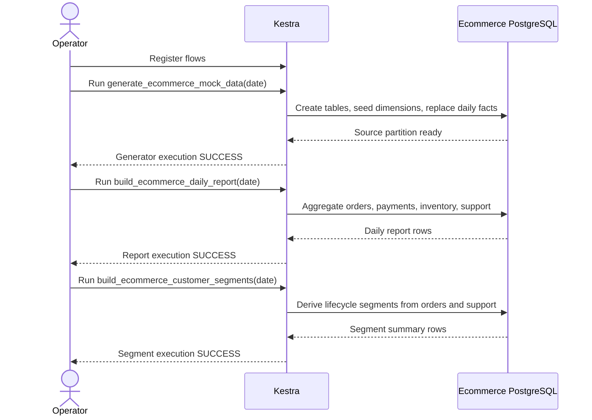

# kestra-playground

Kestra deployment playground for two independently managed batch groups. The repository keeps a
small Python package scaffold, but the primary assets are Kestra flows, local runtime scripts,
Terraform, and Kubernetes manifests.

## Batch Groups

Batch sources are managed per service system under `batch-groups/`:

- `batch-groups/ec/` is the ecommerce batch group (flows, SQL fixtures, and Python/shell batch
  sources). It may run fork-based Kestra images such as the `tacogips/kestra` routed-worker
  build.
- `batch-groups/affiliate/` is the affiliate batch group for a separate service. Its Kestra runtime
  always uses the official `kestra/kestra` distribution, never a `tacogips/kestra` fork build.

Both batch groups share one PostgreSQL server: each Kestra keeps its own metadata database (`kestra`
for EC, `kestra_affiliate` for affiliate) while batch tables live in the shared batch database.
Shared platform assets (Kestra server config and deployment-topology demo flows) stay under
`kestra/`.

## Requirements

- Python 3.12 or newer
- `uv`
- Nix with flakes for the full infrastructure toolchain
- Apple container for the primary local runtime, or Docker Compose as a fallback

## Quick Start

```bash
uv sync --dev
uv run python -m kestra_playground
uv run pytest
```

## Kestra Workloads

Three mock ecommerce flows live under `batch-groups/ec/flows/`:

- `generate_ecommerce_mock_data` creates product, customer, order, payment, inventory, and support
  ticket data in PostgreSQL.
- `build_ecommerce_daily_report` writes and fetches daily operational metrics from that data.
- `build_ecommerce_customer_segments` writes and fetches a customer lifecycle segment snapshot from
  the generated order and support activity.

The batch relationship is intentionally linear: generate the partition first, then build derived
outputs for the same business date.


```mermaid
sequenceDiagram
    actor Operator
    participant Kestra
    participant DB as Ecommerce PostgreSQL

    Operator->>Kestra: Register flows
    Operator->>Kestra: Run generate_ecommerce_mock_data(date)
    Kestra->>DB: Create tables, seed dimensions, replace daily facts
    DB-->>Kestra: Source partition ready
    Kestra-->>Operator: Generator execution SUCCESS

    Operator->>Kestra: Run build_ecommerce_daily_report(date)
    Kestra->>DB: Aggregate orders, payments, inventory, support
    DB-->>Kestra: Daily report rows
    Kestra-->>Operator: Report execution SUCCESS

    Operator->>Kestra: Run build_ecommerce_customer_segments(date)
    Kestra->>DB: Derive lifecycle segments from orders and support
    DB-->>Kestra: Segment summary rows
    Kestra-->>Operator: Segment execution SUCCESS
```

All three flows use `ENV_BATCH_DB_URL`, `ENV_BATCH_DB_USERNAME`, and `ENV_BATCH_DB_PASSWORD` so
local and GCP database connection values can be switched by environment file, Secret Manager, or
Kubernetes Secret.

In GCP, Kestra management state and ecommerce batch data share one database instance but use
separate logical databases: `kestra` for Kestra repository/queue tables and `ecommerce_ops` for
batch tables. Runtime connection values are stored as separate Secret Manager entries for the
Kestra connection and the batch connection, even when a development target temporarily uses the same
PostgreSQL login behind both secret families.

Three affiliate flows live under `batch-groups/affiliate/flows/` and follow the same linear pattern
against the shared batch database: `generate_affiliate_mock_data` seeds partners and daily
click/conversion activity, `build_affiliate_daily_report` aggregates traffic, conversion, and
commission metrics, and `build_affiliate_partner_rankings` ranks partners by approved commission.
The affiliate batch source under `batch-groups/affiliate/batches/` mirrors the remote batch framework
conventions used by the EC batch sources.

The generated ecommerce data is tracked in `batch-groups/ec/fixtures/`. The generator flow embeds
those SQL fixtures into PostgreSQL tasks, and the test suite checks that the deployed flow SQL stays
in sync with the committed fixture files.

Current Kestra OSS requires Basic Auth. Each batch group's local defaults are in its
`batch-groups/<group>/config/envs/local.env.example`; the GCP Terraform roots generate/store runtime
credentials in Secret Manager. The GCE roots read Basic Auth directly from Secret Manager at
startup, and the GKE apply helper renders the Kubernetes Secret from GKE-specific Secret Manager
entries.

## Local Kestra

Apple container path:

```bash
cp local/docker/.env.example local/docker/.env
cp batch-groups/ec/config/envs/local.env.example batch-groups/ec/config/envs/local.env
cp batch-groups/affiliate/config/envs/local.env.example batch-groups/affiliate/config/envs/local.env
mise run kestra:local:apple:start
mise run kestra:flows:register
mise run kestra:flows:verify-mail-notification-local
mise run kestra:flows:generate
mise run kestra:flows:report
mise run kestra:flows:segments
mise run kestra:local:apple:stop
```

Docker Compose fallback:

```bash
cp local/docker/.env.example local/docker/.env
cp batch-groups/ec/config/envs/local.env.example batch-groups/ec/config/envs/local.env
cp batch-groups/affiliate/config/envs/local.env.example batch-groups/affiliate/config/envs/local.env
mise run kestra:local:docker:start
mise run kestra:flows:register
mise run kestra:flows:generate
mise run kestra:flows:report
mise run kestra:flows:segments
mise run kestra:local:docker:stop
```

Both start paths boot the two batch groups side by side against one PostgreSQL container: the EC
Kestra UI defaults to `http://localhost:8080` and the affiliate Kestra UI to
`http://localhost:8082`. Each group can also run on its own, which keeps the shared PostgreSQL and
Mailpit containers up and touches only that group's Kestra (and, for EC, its SSH workers):

```bash
mise run kestra:local:docker:start:ec
mise run kestra:local:docker:start:affiliate
mise run kestra:local:docker:stop:ec
mise run kestra:local:docker:stop:affiliate
```

`local/docker/start.sh <all|ec|affiliate>` and `local/docker/stop.sh <all|ec|affiliate>` back those
tasks; only the `all` stop removes the shared containers. The affiliate flows have their own task entry points:

```bash
mise run kestra:affiliate:flows:register
mise run kestra:affiliate:flows:generate
mise run kestra:affiliate:flows:report
mise run kestra:affiliate:flows:rankings
```

Flow helper scripts can load credentials, URL settings, and default batch date settings from an env
file:

```bash
KESTRA_ENV_FILE=batch-groups/ec/config/envs/local.env scripts/register-flows.sh \
  http://localhost:8080 batch-groups/ec/flows
KESTRA_ENV_FILE=batch-groups/affiliate/config/envs/local.env scripts/register-flows.sh \
  http://localhost:8082 batch-groups/affiliate/flows
```

The `mise run kestra:flows:*` commands use `KESTRA_ENV_FILE` when provided. Otherwise EC commands load
`batch-groups/ec/config/envs/local.env` and affiliate commands load
`batch-groups/affiliate/config/envs/local.env`, falling back to the corresponding checked-in
`.example` file. `local/docker/.env` contains only shared PostgreSQL provisioning values; it is not
a Kestra runtime env file.

Registering/running flows against an authenticated endpoint. If a business date is not provided,
the helper scripts default to the current date in `Asia/Tokyo`; set `BUSINESS_DATE_TZ` to override
that default timezone. Explicit dates must use `YYYY-MM-DD`.

```bash
export KESTRA_BASIC_AUTH_USERNAME=...
export KESTRA_BASIC_AUTH_PASSWORD=...
scripts/register-flows.sh http://34.84.21.87:8080
scripts/run-flow.sh generate_ecommerce_mock_data 2026-06-25 http://34.84.21.87:8080
scripts/run-flow.sh build_ecommerce_daily_report 2026-06-25 http://34.84.21.87:8080
scripts/run-flow.sh build_ecommerce_customer_segments 2026-06-25 http://34.84.21.87:8080
```

## Mail Notification Flows

`kestra/flows-notification/` shows how to mail the success or failure of other tasks, written for
the Kestra 2 flow model that the `tacogips/kestra` fork build runs:

- `playground.system.notify_execution_result` is an independent flow. It contains no business logic
  and is never called by the flows it reports on: a `io.kestra.plugin.core.trigger.Flow` trigger
  fires it on every terminal state of the `playground.notification` namespace, and
  `io.kestra.plugin.email.MailExecution` renders the execution summary, including the failing task
  ID, into the mail. Kestra 2 replaced the 1.x `conditions` / `preconditions` blocks with the
  trigger's `states` list plus a `when` expression evaluated against the upstream flow, so
  `when: "{{ flow.namespace | startsWith(...) }}"` selects which flows are watched.
- `playground.inline.demo_inline_notification` keeps the mail tasks inside the flow in an
  `afterExecution` block, which runs once the execution reached its final state. `execution.state`
  is resolved there, so `runIf` splits the success and failure branches, and
  `tasksWithState('FAILED')` names the failed tasks.
- `playground.notification.sample_sales_batch` is the sample workflow that combines both layers. It
  runs extract, transform, and publish stages, and `fail_stage` (`none`, `extract`, `transform`,
  `publish`) selects which stage fails. Its `errors` block mails the error mail the moment a task
  fails, with the failing task in the subject via `tasksWithState('FAILED')[0]['taskId']`; the
  execution then reaches FAILED and the independent notifier mails the fail mail for the same run,
  so one failure produces one `[ERROR]` mail and one `[FAILED]` mail. Its `finally` block only logs
  cleanup, because `finally` runs while the execution is still `RUNNING` and cannot see the final
  state - which is why the mail tasks are not there.

The affiliate batch group carries the same example for the other category, in
`batch-groups/affiliate/flows/`: `playground.affiliate.system.notify_affiliate_execution_result`
watches the `playground.affiliate` namespace and `playground.affiliate.sample_affiliate_partner_batch`
runs collect, aggregate, and publish stages with the same `fail_stage` switch. That group always runs
the official `kestra/kestra` distribution, which is still the 1.x lineage, so its trigger is scoped
with the 1.x `conditions` block (`ExecutionStatus` plus `ExecutionNamespace`) rather than the Kestra 2
`states` and `when` properties. `ExecutionNamespace` matches the namespace exactly, which is why the
notifier itself sits in `playground.affiliate.system` and never triggers on its own executions.

The local Docker stack provides a mock mailer, so no mail leaves the machine: the `mailpit` service
accepts plain SMTP on `mailpit:1025` and serves the captured messages at `http://localhost:8025`.
The SMTP endpoint and addresses come from `ENV_NOTIFY_*` entries in
`batch-groups/ec/config/envs/local.env`, which Kestra exposes to flows as `{{ envs.notify_* }}`. An
env file created before those entries existed is not refreshed by `start.sh`; copy the `ENV_NOTIFY_*`
block from `local.env.example` into it and recreate the `kestra-ec` container.

The EC fork image is built from `kestra-base:latest-no-plugins` and therefore ships almost no
plugins, so `local/docker/fetch-plugins.sh` downloads the pinned Email, PostgreSQL, and Shell plugin
JARs into `local/docker/plugins/` (checksum-verified, gitignored) and `docker-compose.yml`
bind-mounts them into `/app/plugins`. Without the PostgreSQL plugin the EC batch flows cannot even
register on that image. The versions match the ones the routed image build installs, and a test keeps
the two in sync. `local/docker/start.sh` runs the fetch step automatically; override
`KESTRA_EMAIL_PLUGIN_VERSION`, `KESTRA_JDBC_POSTGRES_PLUGIN_VERSION`, or
`KESTRA_SCRIPT_SHELL_PLUGIN_VERSION` to pin different versions.

```bash
mise run kestra:local:docker:start
mise run kestra:flows:verify-mail-notification-local
mise run kestra:affiliate:flows:verify-mail-notification-local
```

`scripts/verify-local-mail-notification.sh <ec|affiliate>` backs both tasks. The EC run registers the
five Kestra 2 notification flows on `:8080` and exercises the demo batches, both branches of the
inline demo, and both paths of the sample workflow. The affiliate run registers the affiliate flows
on the official 1.x endpoint at `:8082` and exercises the sample affiliate batch. Each asserts that
Mailpit received exactly the expected mails - one `[STATE] namespace.flow` execution summary per
execution plus the sample workflow's `[ERROR] ... task=simulate_*_failure` mail - and that the error
mail body names the failing task.

Keep the local EC service on the fork build once its database has been migrated by Kestra 2:
`local/docker/.env` sets `EC_KESTRA_IMAGE`, and because `start.sh` passes that file to compose with
`--env-file` while unsetting the same keys in the shell, the file wins over an exported variable.
Starting the EC service on `kestra/kestra:latest` (still a 1.x release) against a Kestra 2 database
fails at boot with `type "queue_type" does not exist`.

On GKE the same shape is deployed without a real mail server: `k8s/base/mailpit.yaml` adds a
ClusterIP-only Mailpit sink to the `kestra-dev` namespace, and `scripts/apply-gke-dev.sh` writes the
`ENV_NOTIFY_*` values into the runtime Secret so flows resolve `{{ envs.notify_* }}` to
`mailpit:1025`. The sink has no Ingress, so it is reachable only from inside the cluster and through
`kubectl port-forward`. Override the defaults with `NOTIFY_SMTP_HOST`, `NOTIFY_SMTP_PORT`,
`NOTIFY_MAIL_FROM`, and `NOTIFY_MAIL_TO` when applying. The mail itself is plain SMTP from the Kestra
worker to `mailpit:1025`; Mailpit stores every message and relays none, so nothing reaches a real
mailbox.

The GKE environment runs the `tacogips/kestra` fork build, so it needs its own variant of the
affiliate example in `kestra/flows-notification-affiliate/`. Two properties are not portable between
the lineages, and each fails loudly rather than silently:

- Kestra 2 removed the condition plugins, so registering the 1.x notifier there fails with
  `Unrecognized field "conditions"`. The variant scopes its trigger with `states` and `when`.
- The routed deployment has no worker on the `default` queue - the executor runs core tasks in
  process and subscribes only a `SystemWorker` to the `system` queue - so a plugin task such as the
  mail task stays `SUBMITTED` forever unless it names a worker group. The variant tags its mail tasks
  with `workerSelector: {tags: [gke-small]}`, which the official 1.x distribution does not
  understand.

`scripts/verify-live-mail-notification.sh` reads the endpoint's major version and registers the
matching directory, so the same command works against either lineage.

```bash
mise run k8s:apply:dev
kinko exec --env PROJECT_ID,LIVE_DOMAIN_NAME -- mise run kestra:live:verify-mail-notification
```

The live verifier waits for the Mailpit rollout, port-forwards its API, registers
`batch-groups/affiliate/flows`, runs the sample affiliate batch on the success and failure paths, and
asserts the `[SUCCESS]`, `[FAILED]`, and `[ERROR]` mails plus the error mail body. Set `KESTRA_URL` to
target a specific endpoint and `NAMESPACE` if the sink is not in `kestra-dev`.

## Remote Python Batch Examples

The remote-batch framework has two adapters with one business-script contract. The SSH/SFTP runner
targets unmanaged machines: it copies a Python Namespace File into an execution-specific directory,
runs it over SSH, streams progress/errors, downloads the result, and cleans the directory. The
routed runner targets the GKE/on-prem simulation: an execution FILE upload is stored in Kestra
internal storage and localized into the selected `gke-small` or `gke-large` worker, which runs it
with `uv` and the Process task runner and persists declared output files without SSH.

Two one-task caller flows demonstrate the pattern:

- `export_database_to_csv` exports a date partition from a remote SQLite database to CSV;
- `parse_application_logs` parses remote JSON Lines logs into a JSON summary.

Run both success cases plus an expected remote failure with Docker Compose:

```bash
mise run kestra:local:docker:start
mise run kestra:flows:run-remote-batch-examples
mise run kestra:local:docker:stop
```

Build the current `tacogips/kestra` `main`, then run the same log-parsing batch on two local SSH
targets and prove that only the failed business task retries on the affected target:

```bash
mise run kestra:local:build-latest-fork
EC_KESTRA_IMAGE=tacogips-kestra:latest mise run kestra:local:docker:start
mise run kestra:flows:run-remote-batch-multi-target
```

The multi-target caller accepts a bounded JSON target array. Kestra 2.0 `Loop` runs at most four
target children concurrently. Each child exposes `validate_input`, `execute_batch`, and
`validate_output` as separate business tasks between source staging and artifact collection. Every
task has its own retry boundary, while the child Subflow retains a final target-level fallback. The
verifier injects one `execute_batch` failure on target B and requires both validation tasks to stay
at one attempt on both targets while only target B's execute task records failed and successful
attempts.

Provision or start the two GCP SSH targets, then run the live equivalent from local Kestra:

```bash
set -a
source batch-groups/ec/config/envs/local.env
set +a
PROJECT_ID=kestra-playground-260625 mise run kestra:live:remote-batch-ssh-targets
PROJECT_ID=kestra-playground-260625 mise run kestra:live:run-remote-batch-ssh
```

The provisioner uses a dedicated VPC, reserves one public IPv4 address per target, and restricts
port 22 to the caller's current public IPv4. Use `REMOTE_BATCH_TARGET_ACTION=stop` with the first
command to stop the VMs when they are no longer needed; reserved addresses continue to exist until
explicitly removed.

The local `remote-worker` container models an arbitrary batch machine. The verifiers fail if a
Kestra binary, server process, or container is detected on either target. Production targets do not
need a custom resident agent, but they do need Python 3, an SSH/SFTP account, network reachability
from the Kestra worker role, verified host identity, and credentials supplied through Kestra
Secrets. See `design-docs/specs/design-remote-python-batch-runner.md` for the complete contract and
security boundaries.

For the scale-from-zero GKE topology, no SSH/SFTP server is installed on the destination worker.
The routed Kestra worker is the generic control channel, an execution-scoped bundle plus
`inputFiles` supplies code and fixtures, and `outputFiles` returns artifacts. The batch runtime needs
only `uv`; it uses or provisions Python 3.12. Both the uv cache and managed interpreter are
execution-scoped; an exit trap removes them and the copied source after success or failure, checks
that every runtime path is absent, and preserves the business process exit status. Run the
cold-start, success, failure, cleanup, and scale-to-zero verification with:

```bash
mise run kestra:live:run-remote-batch-routed
```

## Web Console on Cloud Run

`webconsole/` contains a Bun + SolidJS console deployed to Cloud Run that calls the on-premise
Kestra API to trigger the ecommerce batch flows and show the ten most recent executions with
logs. Sign-in uses Google OAuth restricted to an allowlist of emails; the allowlist, OAuth
client, session secret, and Kestra URL/credentials live only in Secret Manager and local env
files, never in git. See `webconsole/README.md` for local development and:

```bash
kinko exec --env PROJECT_ID,WEBCONSOLE_ALLOWED_EMAILS,WEBCONSOLE_GOOGLE_CLIENT_ID,WEBCONSOLE_GOOGLE_CLIENT_SECRET,WEBCONSOLE_KESTRA_URL,WEBCONSOLE_KESTRA_BASIC_AUTH_USERNAME,WEBCONSOLE_KESTRA_BASIC_AUTH_PASSWORD -- task webconsole:secrets
kinko exec --env PROJECT_ID -- task webconsole:deploy
```

## GCP Deployment Shapes

Terraform roots are split by phase:

- `infra/terraform/bootstrap-project`: creates a new GCP project and enables required APIs.
- `infra/terraform/github-actions`: creates the GitHub OIDC provider and deploy service account
  used by the push/manual/cron workflow.
- `infra/terraform/cloud-armor`: creates the shared Cloud Armor policy used by live HTTPS targets.
- `infra/terraform/gce-single`: one GCE VM running Kestra and PostgreSQL through Docker Compose,
  with separate Kestra and batch DB connection values loaded from Secret Manager.
- `infra/terraform/gce-cluster`: multiple GCE VMs running separated Kestra components against shared
  Cloud SQL and GCS. The Cloud SQL instance contains separate `kestra` and `ecommerce_ops`
  databases, and each JDBC connection family has its own Secret Manager entries.
- `infra/terraform/gke-dev`: GKE Autopilot, a reserved VPC-internal PostgreSQL address, GCS, and Workload Identity inputs for the
  Kubernetes manifests. It stores GKE runtime DB connection values in Secret Manager, renders them
  into Kubernetes only during apply, and acts as the federated OSS controller. The former GKE
  migration-source Cloud SQL instance has been removed after verified cutover.

System shape, at a high level:

- One workload contract: the same Kestra flows and runtime image are used locally, on GCE, and on
  GKE.
- One release artifact: GitHub Actions builds the Kestra runtime image and publishes it to Artifact
  Registry with a commit tag plus `latest`.
- Three live HTTPS targets: single-VM Docker Compose, GCE component cluster, and GKE Autopilot each
  have their own subdomain under `example.com`.
- Terraform owns cloud infrastructure, DNS records, Secret Manager entries, load balancers, and
  managed data services. Kustomize owns Kubernetes workload shape.
- A shared Google Cloud Armor policy protects the HTTPS backends with per-client rate limiting and
  an optional source block list.
- Secret values stay outside git; local env files, Secret Manager, GitHub Actions secrets, and
  `kinko` provide runtime values.

The GCE cluster root runs Cloud SQL Proxy as a Docker Compose service, so Kestra uses
`cloud-sql-proxy:5432`. The GKE runtime instead uses `kestra-postgres:5432`, backed by a retained
Persistent Disk through a PostgreSQL StatefulSet. GCE workers attached to the GKE controller use a
VPC-internal LoadBalancer address for the same StatefulSet.

For the OSS-compatible federated execution pattern, keep separate Kestra deployments instead of
trying to attach remote workers to one OSS worker queue. In the live dev-as-prod topology:

- `gce-compose` is GCE worker A and receives `playground.ecommerce.server_gce_a`;
- `gce-container` is GCE worker B and receives `playground.ecommerce.server_gce_b`;
- `k8s` is the controller Kestra only and does not run a `kestra-worker` Deployment;
- the `gke-dev` Terraform root also creates a GCE `controller-worker` VM that runs only
  `kestra server worker` against the GKE controller backend;
- `batch-groups/ec/flows` is rendered and registered only on the two GCE child deployments;
- `kestra/flows-federated` is registered only on the GKE controller.

The controller flow calls child Kestra REST APIs, waits for child execution status, and records child
execution IDs in its own task outputs. Rerunning the controller flow reruns the GCE child
executions. This keeps production-like workflow shape without using Enterprise Worker Groups or the
removed DB-backed agent implementation.

No Kestra worker process is allowed to run in GKE. Lightweight controller HTTP, polling, and
assertion tasks are claimed by the GCE `controller-worker` VM because it uses the same GKE
controller DB, queue, and GCS storage configuration. The two GCE child Kestra deployments remain the
execution targets for ecommerce batch work; they are separate from the controller-worker process.

```bash
kinko exec --env PROJECT_ID,LIVE_DOMAIN_NAME,CLOUDFLARE_ZONE_ID,TOFU_STATE_BUCKET,CLOUDFLARE_API_TOKEN -- task kestra:live:deploy:federated
kinko exec --env PROJECT_ID,LIVE_DOMAIN_NAME -- task kestra:live:run-federated
```

Example bootstrap:

```bash
cd infra/terraform/bootstrap-project
tofu init
tofu apply \
  -var='project_id=kestra-playground-dev-<unique-suffix>' \
  -var='billing_account=XXXXXX-XXXXXX-XXXXXX' \
  -var='org_id=123456789012'
```

The commands use OpenTofu from the Nix shell; the files are Terraform-compatible.

Set the live development project through `PROJECT_ID` or `GCP_PROJECT_ID`; do not commit real
project IDs.

Kestra runtime images are published to Artifact Registry:

```text
<region>-docker.pkg.dev/<project-id>/kestra-playground/kestra-runtime
<region>-docker.pkg.dev/<project-id>/kestra-playground/kestra-oss-worker-routing
```

The runtime image extends `kestra/kestra:latest` and bakes in `batch-groups/` (per-system flows,
fixtures, and batch sources), `kestra/config/`, and the Python package source under `src/`. The
deployment
workflow builds and pushes a commit-SHA tag plus `latest`, then passes the SHA-tagged image to
Terraform through `KESTRA_IMAGE`. The GCE roots use that image in Docker Compose; the GKE apply
helper applies the same image through Kustomize before `kubectl apply`.

For the shared-backend routed target, the deployment workflow checks out the pinned
`tacogips/kestra@bf0e3240580448a80c4fc4850883d88c50e484a7` revision from `main`, builds the custom Kestra executable, installs the GCS
storage, shell, and Kubernetes plugins, pushes `kestra-oss-worker-routing` tags to Artifact
Registry, and deploys the commit-SHA tag.

The same routed image can be tested with Kubernetes-hosted routed workers by setting
`LIVE_GKE_ROUTED_K8S_WORKERS_ENABLED=true` before `scripts/apply-gke-dev.sh`. This renders
`kestra-gke-worker-small` and `kestra-gke-worker-large`, each with its own `workerGroupId` and
`workerSelector.tags` queue. The verification flow logs the worker pod and Kubernetes node name for
each task. For exact live-node verification, set `LIVE_GKE_ROUTED_K8S_WORKER_*_NODE_NAME`; for a
durable placement-domain test, use selector variables such as
`LIVE_GKE_ROUTED_K8S_WORKER_*_NODE_SELECTOR_KEY=topology.kubernetes.io/zone`. In the current GKE
Autopilot shape, `nodeSelector: kubernetes.io/hostname` is rejected. Direct `spec.nodeName` is
accepted by the API, but it bypasses normal scheduling, does not trigger Autopilot scale-up, and
can fail if the chosen node lacks local free CPU or memory.

The batch-group broadcast contract can also be proven locally without a container runtime after
building a sibling `tacogips/kestra` checkout. `mise run kestra:flows:run-batch-group-broadcast-local`
starts a temporary PostgreSQL database, a controller, and two workers in one group, then verifies
that `verify_batch_group_broadcast` produces two worker-keyed outputs and logs both member names.

The routed K8s workers can also run with access-driven scale-from-zero instead of fixed replicas.
Setting `LIVE_GKE_ROUTED_K8S_WORKER_AUTOSCALE_ENABLED=true` together with
`LIVE_GKE_ROUTED_K8S_WORKERS_ENABLED=true` renders both worker Deployments at `replicas: 0` and
deploys a resident `kestra-worker-activator` nginx proxy in front of `kestra-webserver`. The first
request through `svc/kestra-worker-activator` (for example via
`kubectl -n kestra-dev port-forward svc/kestra-worker-activator 8080:80`) wakes all routed
workers to one replica; after `LIVE_GKE_ROUTED_K8S_WORKER_IDLE_SECONDS` (default 1800) without
access an idle reaper scales them back to zero. HPA is intentionally not used because a second
replica of one `workerGroupId` would break the one-worker-per-machine routing model. Adding
`LIVE_GKE_CONTROL_PLANE_AUTOSCALE_ENABLED=true` extends the same parking to the webserver,
executor, scheduler, and indexer. Adding `LIVE_GKE_DATABASE_AUTOSCALE_ENABLED=true` also parks the
in-cluster PostgreSQL StatefulSet while retaining its PVC. Wake-up starts PostgreSQL first; idle
shutdown stops it last. In this dev-only cost mode the HTTPS Ingress targets the activator, the
stack stays up for one idle window after each deploy, then parks, and the next public access boots
it back. The first cold request can receive HTTP 503 during startup, and schedule triggers do not
fire while parked. See `design-docs/specs/design-gke-full-stack-scale-to-zero.md`.

For exact worker-class placement with autoscale, set `gke_autopilot_enabled=false` in the GKE
Terraform root. That creates GKE Standard autoscaled node pools labeled by worker group, so routed
worker Deployments can select `kestra.tacogips.io/worker-group=gke-small` or `gke-large` and the
cluster autoscaler can remove unused node-pool capacity. The Standard worker pools are also tainted
with the same worker-group value, and the rendered routed workers tolerate that taint, so ordinary
GKE add-on pods are less likely to occupy an otherwise unused worker-only node.

For the OSS Kubernetes pod-resource topology, use `kestra/flows-k8s-pod-resources`. This keeps a
normal Kestra worker in GKE, but the batch work itself is launched as Kubernetes pods with
per-batch `resources.requests` and `resources.limits`. The flow does not set `nodeSelector`; GKE
schedules the pods and the cluster autoscaler chooses or creates nodes from the requested resources.
This is the OSS path when the requirement is "Batch 1 gets a small pod, Batch 2 gets a large pod",
not "Batch 1 must run on worker A". The verifier labels the created pods by execution/resource
class, checks their actual CPU and memory requests/limits through `kubectl`, and deletes the test
pods after inspection.

Live dev tfvars and backend config are generated under `infra/live/dev/` and ignored by git. They
contain environment-specific project, domain, Cloudflare zone, and state bucket values. Keep those
values in `kinko` locally, or in GitHub repository variables/secrets for CI:

```bash
kinko exec --env PROJECT_ID,LIVE_DOMAIN_NAME,CLOUDFLARE_ZONE_ID,TOFU_STATE_BUCKET,CLOUDFLARE_API_TOKEN -- task kestra:live:deploy
kinko exec --env PROJECT_ID,LIVE_DOMAIN_NAME -- task kestra:live:verify
kinko exec --env PROJECT_ID,LIVE_DOMAIN_NAME -- task kestra:live:run-batch
```

Limit a command to one environment with `TARGET_ENVIRONMENT`:

```bash
TARGET_ENVIRONMENT=gce-container BUSINESS_DATE=2026-06-25 task kestra:live:run-batch
```

Direct batch execution is disabled for `TARGET_ENVIRONMENT=k8s`; use
`mise run kestra:live:run-federated` for the GKE controller path.

GitHub Actions deploys on push to `main`, supports manual dispatch for selected environments, and
runs the ecommerce batch on a daily cron. The workflow uses GitHub OIDC for Google Cloud auth and
expects these repository secrets:

- `GCP_WORKLOAD_IDENTITY_PROVIDER`
- `GCP_SERVICE_ACCOUNT`
- `CLOUDFLARE_API_TOKEN`
- `CLOUDFLARE_ZONE_ID`

It also expects repository variables for the live project, domain, state bucket, image repository,
and optional environment URL.

Live Terraform state uses a GCS bucket provided through generated backend config. The live roots use
per-root prefixes so GitHub Actions can deploy from a fresh checkout without recreating existing
resources.

## Per-Batch-Group Deploys

`.github/workflows/deploy-batch-groups.yml` deploys the two batch groups independently:

- Pushing a release tag selects the system by prefix: `EC-x.y.z` deploys `batch-groups/ec/flows` and
  `AFFILIATE-x.y.z` deploys `batch-groups/affiliate/flows`. Tags that do not match the `x.y.z` version
  shape fail the run.
- Pushing to `main` deploys each system whose sources under `batch-groups/<system>/` changed in that
  push, ignoring Markdown-only changes.

Both paths run the standard project checks first and then call
`scripts/deploy-batch-group.sh <system>`, which registers the system's flow directory against
its Kestra endpoint. Development doubles as staging, so both groups currently target the one Kestra
on GKE: `batch-groups/affiliate/config/envs/gcp.env.example` points the affiliate group at the `k8s`
subdomain and the `kestra-dev-gke` Basic Auth secrets, because no separate affiliate deployment
exists yet. Since that endpoint runs the Kestra 2 fork build and scales to zero, the deploy script
waits for the endpoint to wake, reads its major version, and swaps the affiliate notification flow
for the matching variant. Each group owns non-secret GCP routing defaults in
`batch-groups/<system>/config/envs/gcp.env.example`; an ignored `gcp.env` or an explicit
`BATCH_GROUP_ENV_FILE` overrides that template. Endpoints resolve from `EC_KESTRA_DEPLOY_URL` /
`AFFILIATE_KESTRA_DEPLOY_URL`, then from `LIVE_DOMAIN_NAME` subdomains
(`LIVE_EC_KESTRA_SUBDOMAIN`, default `k8s`; `LIVE_AFFILIATE_KESTRA_SUBDOMAIN`, default
`affiliate-kestra`), and fall back to the local endpoints. Basic Auth values come from the
environment or from Secret Manager prefixes (`EC_KESTRA_AUTH_SECRET_PREFIX`, default
`kestra-dev-gke`; `AFFILIATE_KESTRA_AUTH_SECRET_PREFIX`, default `kestra-affiliate`).
`PROJECT_ID`, `LIVE_DOMAIN_NAME`, and all secret payloads remain externally injected by kinko, CI,
or Secret Manager rather than being committed to the GCP env templates.
GCP templates set `KESTRA_AUTH_SOURCE=secret-manager`, preventing local direnv credentials from
silently overriding live credentials. Set `KESTRA_AUTH_SOURCE=environment` only for an intentional
credential override.

The affiliate deploy target must always run the official `kestra/kestra` distribution; only the
EC system may deploy onto `tacogips/kestra` fork builds such as the routed-worker image.

The same deploys can be run manually:

```bash
mise run kestra:batch-groups:deploy:ec
mise run kestra:batch-groups:deploy:affiliate
```

## Operations Flow

The normal operating path is:

1. Change flows, fixtures, app source, Terraform, Kubernetes manifests, or docs.
2. Run local validation through `mise run ci` and targeted infrastructure checks.
3. Push to `main`; GitHub Actions builds and publishes the runtime image.
4. Deploy the selected live targets with the SHA-tagged image.
5. Verify HTTPS readiness and register the checked-in flows.
6. Run the batch sequence for a business date: generate data, build the report, then build customer
   segments.
7. Check Cloud Armor policy attachment and logs when investigating abuse or rate limiting.
8. For GKE, check the OpenTelemetry Collector when trace-level evidence is needed.

Manual operations use the same scripts as CI:

```bash
kinko exec --env PROJECT_ID,LIVE_DOMAIN_NAME,CLOUDFLARE_ZONE_ID,TOFU_STATE_BUCKET,CLOUDFLARE_API_TOKEN -- task kestra:live:deploy
kinko exec --env PROJECT_ID,LIVE_DOMAIN_NAME -- task kestra:live:verify
kinko exec --env PROJECT_ID,LIVE_DOMAIN_NAME -- task kestra:live:run-batch
```

The promotion contract is intentionally narrow: keep business logic in one checked-in source
location, build one runtime image, deploy the commit-SHA tag, and use environment-specific Kestra
wrappers only for substrate differences such as local Process tasks, GKE PodCreate resources, or
routed GCE workers. For production-like confidence, run the verifier that matches the release risk:
normal batch verification for data/flow changes, operation-demo GKE PodCreate verification for
per-batch resources, routed-worker verification for placement-sensitive work, and federated
verification for GKE-controller-to-GCE-child orchestration.

## HTTPS Domains

The GCE single-VM, GCE cluster, and GKE dev Terraform roots support HTTPS domain configuration.
The Cloudflare-backed development hostnames are derived from generated live config:

- GKE: `https://k8s.example.com`
- GCE clustered container environment: `https://gce-container.example.com`
- GCE single VM Docker Compose environment: `https://gce-compose.example.com`

Start from the checked-in example variables for the root you are applying:

```bash
cp infra/terraform/gce-cluster/terraform.tfvars.example infra/terraform/gce-cluster/terraform.tfvars
```

Then set `domain_name` plus an environment subdomain and apply:

```bash
tofu apply \
  -var='project_id=<project-id>' \
  -var='domain_name=example.com' \
  -var='subdomain=gce-container' \
  -var='dns_provider=cloudflare' \
  -var='cloudflare_zone_id=<cloudflare-zone-id>'
```

When `dns_provider=cloudflare`, set `CLOUDFLARE_API_TOKEN` in the environment. In this workspace,
the token and live DNS values are stored in `kinko`, so Terraform can be run with:

```bash
kinko exec --env CLOUDFLARE_API_TOKEN,CLOUDFLARE_ZONE_ID,LIVE_DOMAIN_NAME -- tofu apply ...
```

When `dns_provider=google` and `create_dns_zone=true`, the root creates a Cloud DNS managed zone and outputs
`dns_name_servers`; delegate the parent domain to those name servers at the registrar. When using an
existing Cloud DNS zone, set `create_dns_zone=false` and `dns_zone_name=<zone-name>`.

After DNS record propagation, Google-managed certificates can take several minutes to become active.
The GKE root reserves the static ingress IP and creates the Cloudflare A record; the dev Kubernetes
overlay contains the matching `k8s.example.com` host and `kestra-dev-ingress` static IP name.

## Cloud Armor DoS Mitigation

`infra/terraform/cloud-armor` creates one shared Google Cloud Armor security policy for the live
HTTPS targets. The deploy helper applies that root first, reads the policy outputs, and renders the
ignored live tfvars so:

- `gce-compose` attaches the policy to the single-VM HTTPS backend service.
- `gce-container` attaches the same policy to the clustered web backend service.
- `k8s` attaches the same policy through the GKE `BackendConfig`.

The default policy throttles each client IP after 300 requests per 60 seconds and returns HTTP 429
for excess requests. Tune `CLOUD_ARMOR_RATE_LIMIT_REQUESTS_PER_INTERVAL`,
`CLOUD_ARMOR_RATE_LIMIT_INTERVAL_SEC`, and `CLOUD_ARMOR_PREVIEW` through `kinko` or CI variables
before deploy when a different threshold or observe-only rollout is needed.

Cloud Armor Standard cost is roughly one security policy plus rules and request processing. For this
playground, expect a small fixed monthly cost for one shared policy and its rules, plus request
volume charges.

## Kubernetes

Kubernetes manifests are Kustomize-based:

```bash
kustomize build k8s/overlays/dev
scripts/apply-gke-dev.sh
```

The GKE dev overlay includes an in-cluster OpenTelemetry Collector at
`otel-collector.kestra-dev.svc.cluster.local` with OTLP/gRPC on `4317` and OTLP/HTTP on `4318`.
Kestra's Kubernetes `application.yaml` enables Micronaut OpenTelemetry and Kestra flow traces by
default, exporting traces, metrics, and logs to `http://otel-collector:4317`.

Each GKE Kestra control component sets a distinct `OTEL_SERVICE_NAME` (`kestra-webserver`,
`kestra-executor`, `kestra-scheduler`, and `kestra-indexer`) plus resource attributes for the
namespace, pod, environment, and Kestra component. The GKE overlay intentionally does not run a
`kestra-worker` Pod; worker telemetry for executed tasks must come from the GCE worker environment.
Batch flow tasks are split into granular SQL steps so OTEL traces expose auditable spans for
purging, inserts, summaries, and fetches.

After applying GKE, verify telemetry is being received by checking the collector rollout and logs:

```bash
kubectl -n kestra-dev rollout status deployment/otel-collector
kubectl -n kestra-dev logs deployment/otel-collector --tail=200
```

Collector spans include `kestra.executionId`, `kestra.flowId`, and `kestra.uid`. The `kestra.uid`
value maps to the task-run ID returned by the Kestra execution API, which lets operators correlate
collector spans back to specific granular batch tasks.

Apply the live GKE overlay with Terraform outputs without writing real secrets into the repository:

```bash
mise run k8s:apply:dev
```

For the live GKE environment, Kestra Basic Auth and database connection values are stored in Secret
Manager under the `kestra-dev-gke-*` prefix. `scripts/apply-gke-dev.sh` reads the secret IDs from
Terraform outputs, accesses the latest enabled versions at apply time, and writes values only into a
temporary rendered manifest before updating the Kubernetes Secret.

## Common Commands

```bash
mise run sync
mise run run
mise run test
mise run lint
mise run typecheck
mise run fmt
mise run build
mise run scripts:check
mise run kestra:local:apple:start
mise run kestra:flows:register
mise run infra:fmt
mise run k8s:build:dev
mise run k8s:apply:dev
```
