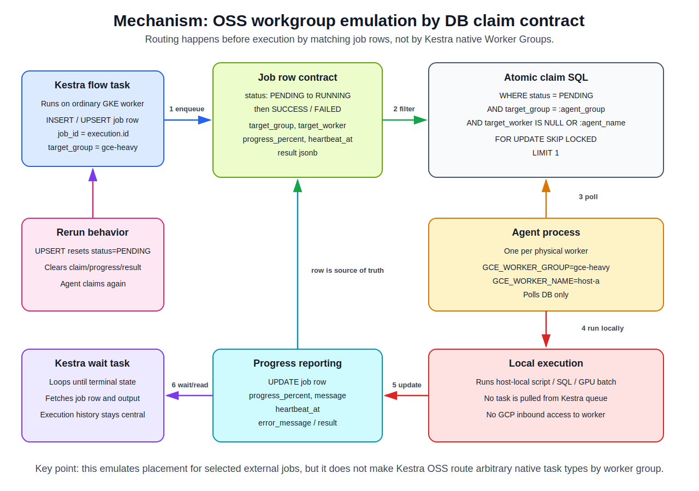

# Kestra Enterprise Worker Group Mechanism

This report documents how Kestra Enterprise Worker Groups route tasks to selected workers, how
mixed GKE, GCE, and on-premises deployments communicate, and which credentials protect each layer.

## Overview

Kestra Worker Groups are an Enterprise Edition feature for deterministic routing to a set of
always-on Kestra worker processes. They are useful when a task must run on a specific execution
environment, such as a GPU VM, a Windows host, an on-premises machine close to private data, or a
worker with restricted backend access.

The operational model is not "install a separate lightweight agent." A remote execution host runs
the normal Kestra Enterprise runtime, usually only the `worker` server component:

```bash
kestra server worker --worker-group gpu
```

Tasks or polling triggers target that group with:

```yaml
workerGroup:
  key: gpu
  fallback: WAIT
```

All processes are part of one Kestra deployment because they share the same Kestra metastore,
queueing backend, internal storage, tenant and namespace metadata, and Enterprise configuration.

## Component Topology

A typical hybrid Enterprise topology for this project would be:

```text
GKE control plane:
  webserver
  executor
  scheduler
  indexer
  default worker

GKE general worker group:
  kestra server worker --worker-group gke-general

GCE GPU or heavy worker group:
  kestra server worker --worker-group gce-heavy

On-premises worker group:
  kestra server worker --worker-group onprem-private

Shared backends:
  Kestra repository and queue backend
  distributed internal storage
  Enterprise license/configuration
```

The same Kestra runtime image or binary should be used where practical so plugin versions,
serialization, and task behavior remain aligned. The worker hosts do not need to expose the UI or
API unless they also run the webserver component.

## Communication Model

Worker Group communication is mediated by Kestra's shared backend, not by direct SSH or direct
control-plane-to-worker RPC.

In a medium JDBC deployment, distributed server components communicate through PostgreSQL or MySQL.
Workers poll and claim eligible work from the shared backend, and all distributed components need a
shared internal storage implementation such as GCS, S3, or Azure Blob Storage when they run on
different hosts.

In Enterprise high-availability mode, Kafka is the event and task-dispatch backbone. Workers are
Kafka consumers, executors maintain execution state and merge worker results, and Elasticsearch is
used by the API/UI for fast reads. The official deployment architecture describes HA mode as
Enterprise-only.

The practical network dependencies are therefore:

- worker to Kestra metastore or Kafka;
- worker to shared internal storage;
- worker to any task-specific data plane, such as Cloud SQL, BigQuery, an on-premises database, or a
  GPU-local filesystem;
- optional worker to Secret Manager or another secret source;
- no required inbound connection from GKE webserver to the remote worker for task dispatch.

For on-premises workers, prefer outbound connectivity over VPN, Cloud Interconnect, private service
connectivity, or a private network path. Do not expose the Kestra database or Kafka brokers to the
public internet.

## Private On-Premises Rerun Model

Worker Groups fit private on-premises execution well because remote workers are consumer-side
participants. A rerun started from the GKE-hosted Kestra UI or API updates execution state in the
shared Kestra backend. The on-premises worker then polls or consumes the eligible task for its
Worker Group and reports state back through the same backend.

For a JDBC deployment, the steady-state path is:

```text
GKE Kestra components -> Cloud SQL / shared internal storage
on-prem Kestra worker -> Cloud SQL / shared internal storage
```

For Enterprise HA, the analogous path is:

```text
GKE Kestra components -> Kafka / Elasticsearch / shared internal storage
on-prem Kestra worker -> Kafka / shared internal storage
```

The important boundary is that GKE does not need to open a direct inbound connection to the
on-premises machine to start or rerun a batch. The on-premises worker can run in a private network
with outbound-only access to the shared Kestra backend and storage over a private network path.

This is operationally convenient for regulated or private data environments:

- on-premises firewall rules do not need to allow inbound task-dispatch traffic from GCP;
- GCP-side operators can rerun executions through the central Kestra UI/API;
- execution state, retries, and task-run metadata remain centralized in Kestra;
- local data access can stay on-premises because the worker executes the task inside that network.

The model is not limited to `on-prem -> Cloud SQL` only. Depending on the selected Kestra deployment
mode and task implementation, the worker may also need outbound access to:

- shared internal storage, such as GCS, S3, or Azure Blob Storage;
- Kafka in Enterprise HA mode;
- Artifact Registry, GCS, or an internal artifact repository for container images or scripts;
- secret providers such as Secret Manager, Vault, or an on-premises secret store;
- task-specific GCP APIs or private data services.

The security design should avoid public exposure of Cloud SQL, Kafka, or object storage wherever
possible. Use VPN, Cloud Interconnect, private Google access patterns, TLS or mTLS, IAM database
authentication, and least-privilege service identities.

## Routing Semantics

`workerGroup.key` targets a group, not a specific machine identity. If exactly one task must always
run on one specific host, create a Worker Group containing only that host. If a Worker Group contains
multiple workers, Kestra load-balances within that group.

If `workerGroup.key` is omitted, `null`, or blank, the task uses the default Worker Group. The
default group has no dedicated key. Kestra recommends keeping at least one default worker available.

Fallback behavior controls what happens when no matching worker is available:

- `WAIT`: the default; the task remains pending until a matching worker picks it up;
- `FAIL`: the task fails immediately when the group is unavailable;
- `CANCEL`: the task is killed without an error.

Fallback settings can be specified directly on a task, by namespace, or by tenant. Task-level
configuration has the highest priority.

## Authentication and Authorization Layers

There are two separate security surfaces.

User and API authentication protects the Kestra webserver:

- Basic Auth is available by default in Enterprise.
- OIDC/SSO can be configured for user login.
- JWT signing/encryption secrets must be consistent across webserver instances.

Internal worker participation is protected by infrastructure credentials and configuration:

- JDBC credentials, IAM database auth, Cloud SQL Auth Proxy, or equivalent database access;
- Kafka SASL/TLS or mTLS credentials in HA deployments;
- shared internal storage credentials for GCS, S3, or Azure Blob Storage;
- the same Enterprise license/configuration scope;
- the same relevant encryption and secret configuration where Kestra components need to decrypt or
  interpret shared metadata.

A remote worker does not normally log into the webserver to receive tasks. It authenticates to the
backend services used by the Kestra cluster.

## GKE, GCE, and On-Premises Design Implications

For a GKE control plane with selected GCE or on-premises heavy workers:

- run control-plane components and normal workers in GKE;
- run only `kestra server worker --worker-group <key>` on GCE or on-premises hosts;
- place GPU tasks in a dedicated group such as `gce-gpu`;
- place private-network tasks in a group such as `onprem-private`;
- keep exactly one worker in a group when the requirement is "this task must run on this exact
  machine";
- use private networking and least-privilege credentials for DB/Kafka/storage access;
- monitor Worker Group health in the Enterprise UI and verify task-run metadata shows the expected
  `workerGroup` and `workerId`.

The control plane remains the owner of execution state, retries, logs, and progress. Remote workers
execute task runs and report state through the shared backend.

## Constraints

Worker Groups do not remove the need to operate the shared Kestra backend securely across all
locations. A remote worker is powerful because it can consume tasks and access shared execution
state; its service identity must be treated like production infrastructure.

Worker Groups are Enterprise Edition only and are not available in Kestra Cloud according to the
current Worker Group documentation. OSS deployments should not rely on `workerGroup.key` for
deterministic placement. In OSS, ordinary workers are part of the same worker pool and Kestra
load-balances work across available workers.

## OSS Emulation Tradeoff

It is tempting to emulate Worker Groups in OSS by giving each physical server an environment value
such as `SERVER_GROUP=gce-heavy`, configuring a namespace-to-group convention, and making each worker
skip tasks that do not belong to its group. That is not a reliable design because the routing
decision happens too late. Once an OSS Kestra worker claims a task from the shared queue, Kestra
treats that worker as responsible for the task run. A post-claim skip can produce false success,
false skip, failure/retry noise, or starvation, and there is no guarantee the retry will land on the
correct physical host.

Correct routing must happen before claim. Enterprise Worker Groups implement that inside Kestra:

```text
task has workerGroup = gpu
only workers in gpu group poll or consume that task
```

In OSS, the practical equivalent is an external job queue whose claim predicate includes the target
group:

[](https://miro.com/app/board/uXjVHBHF2p8=/)

The image above is a Markdown snapshot of the Miro mechanism diagram. The editable source board is:
<https://miro.com/app/board/uXjVHBHF2p8=/>.

```text
Kestra OSS flow
  enqueue external_jobs(target_group = 'gce-heavy')
  wait for SUCCESS / FAILED / timeout
  fetch result, progress, and artifacts

GCE or on-premises agent
  WORKER_GROUP=gce-heavy
  claim only PENDING rows where target_group = WORKER_GROUP
  run the local batch
  update status, progress, logs, and result
```

This preserves deterministic placement for wrapped heavy jobs without forking Kestra. It is not a
drop-in replacement for Enterprise Worker Groups because arbitrary Kestra task types are not routed
to the remote host. Only tasks explicitly modeled as external jobs use the custom placement layer.

The tradeoff is therefore:

| Approach | Benefit | Cost |
|----------|---------|------|
| Enterprise Worker Groups | Native Kestra routing, logs, task state, retry semantics, health visibility, and arbitrary task support | Enterprise license and shared backend exposure to remote workers |
| OSS external job queue | OSS-compatible deterministic placement for selected GCE/on-premises/GPU batches | Custom agent, custom queue schema, weaker native task visibility, and wrapper-style retries |
| OSS Kestra fork | Could make routing native without Enterprise | High maintenance cost and risk across Kestra executor, worker, queue, retry, liveness, UI, and API behavior |
| Post-claim skip in OSS workers | Superficially simple | Incorrect routing model; unreliable and should be avoided |

Using an external queue does reduce Kestra's role for that specific heavy step. Kestra remains the
central orchestrator for schedules, inputs, dependency ordering, enqueue, wait, timeout, wrapper
retry, result collection, alerts, audit history, and manual reruns. The external agent becomes the
actual execution engine for the heavy batch step.

To keep the Kestra experience useful, the external agent should push enough metadata back for Kestra
to aggregate:

- `status`, `progress`, `claimed_by`, `started_at`, and `finished_at`;
- `exit_code`, failure reason, and retryable/non-retryable classification;
- result JSON for downstream tasks;
- log or artifact URIs;
- event rows for progress history.

Decision guidance:

- Use Enterprise Worker Groups when many tasks must remain native Kestra tasks while running on
  specific private, GPU, OS-specific, or tenant-isolated workers.
- Use the OSS external queue when only a small number of heavy/private batches need deterministic
  placement and wrapper-level observability is acceptable.
- Avoid post-claim skip logic in OSS workers.

## Environment Parity Limits

The OSS DB-backed agent pattern cannot make a GKE-only local or staging environment physically
equivalent to production when production delegates work to GCE, GPU, or on-premises agents. The
shared object is the external-job contract, not the execution topology.

This means a GKE-only local or staging environment can validate:

- Kestra flow syntax, inputs, dependencies, and wrapper task behavior;
- queue table creation, enqueue SQL, wait loop, timeout handling, and result parsing;
- downstream tasks that consume the external job result.

It cannot validate:

- placement on the real GCE, GPU, or on-premises host;
- agent startup, environment variables, service identity, and Secret Manager or local secret access;
- private networking, Cloud SQL proxy mode, VPN or on-premises outbound-only connectivity;
- GPU drivers, local filesystem dependencies, host-installed scripts, or private data locality;
- production failure modes such as a dead agent, stale heartbeat, host reboot, or partial local
  output.

The recommended environment strategy is therefore:

| Environment | Recommended shape | What it proves |
|-------------|-------------------|----------------|
| Local | Native Kestra task or an in-cluster/mock DB agent | Flow contract and fast functional feedback |
| Staging | GKE Kestra plus one cheap external GCE agent when placement matters | End-to-end routing, claim behavior, private-network path, and agent lifecycle |
| Production | GKE Kestra plus real GCE, GPU, or on-premises agents | Actual deterministic placement and private/heavy execution |

If staging must remain GKE-only, it should be treated as a contract test environment, not as a
production-topology rehearsal. In that case, add at least one separate integration environment or
scheduled smoke test that runs the real external agent path before relying on the production setup.

## Active OSS Implementation: Federated Kestra

Because local/staging and production workflow parity is a hard requirement, the active OSS
implementation does not use the DB-backed agent wrapper and does not use Enterprise Worker Groups.
It uses separate Kestra deployments and API orchestration:

```text
GKE controller Kestra
  run_federated_ecommerce_batch
    -> trigger GCE child Kestra flow
    -> poll GCE child execution state
    -> trigger GKE child Kestra flow
    -> poll GKE child execution state
    -> expose child execution IDs in controller output

GCE child Kestra
  native ecommerce flows

GKE child Kestra
  native ecommerce flows
```

For local development, the same controller/child contract can be pointed at one local Kestra or at
multiple local namespaces as a cheap functional check. For dev-as-prod verification, the controller
uses the real live targets:

| Role | Live target | Flow directory |
|------|-------------|----------------|
| GKE controller | `k8s` | `kestra/flows-federated` |
| GKE child worker | `k8s` | `kestra/flows` |
| GCE child worker | `gce-container` | `kestra/flows` |

This keeps server-side work as native Kestra tasks inside each child deployment. The controller UI
can manage and rerun the high-level orchestration and can display the child execution IDs. Detailed
native task logs and per-task reruns remain in the child Kestra deployment that actually executed
the work.

## References

See `design-docs/references/README.md`.
