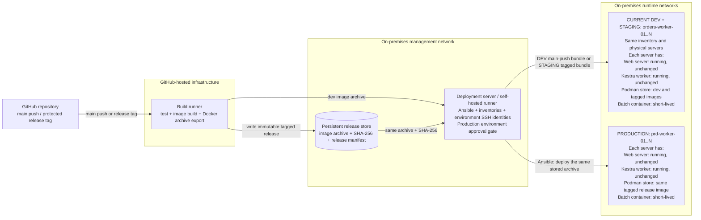
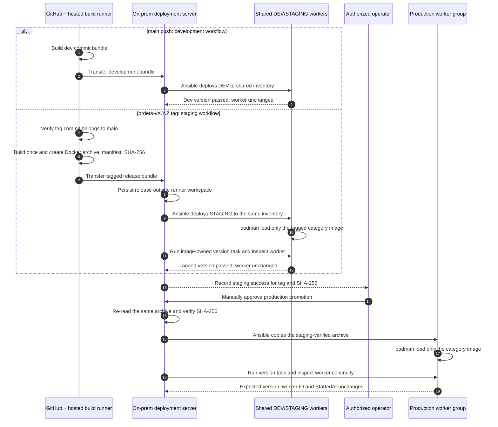
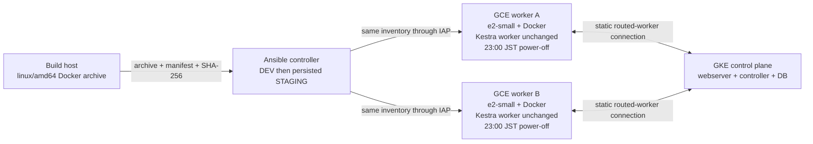

# On-Premises Category Logic Deployment

This design deploys a category-owned OCI image to multiple Podman worker hosts without a registry
and without restarting the long-running Kestra worker or unrelated web containers. The GCP
simulation uses Docker 20.10 on persistent GCE hosts and the same runtime-selectable playbook.

## Success Criteria

- One immutable archive is loaded on every host in the selected Ansible inventory group.
- The image-owned version task reports the expected version and Git revision on every host.
- The Kestra worker container ID and `StartedAt` value remain unchanged during deployment.
- A real Kestra Flow runs both a normal and dedicated batch from the newly loaded image.
- Each Flow execution exposes and validates the image build version and Git revision.
- A periodic audit detects a missing image, an outdated image, a stopped worker, or a version drift.
- Updating one category does not load or restart images belonging to other categories.

## Architecture



The Kestra runtime image and the category logic image have independent lifecycles. `podman load`
updates only local image storage; it does not replace a running worker container. A subsequent batch
task starts a new short-lived container from the immutable category image reference.

The deployment server can also be the self-hosted GitHub Actions runner. Its persistent release
store, not the runner workspace or mutable Podman cache, is the source of truth for staging and
production. Staging and production use different inventories and SSH identities, but production
receives the exact archive and SHA-256 that passed staging.

## Tagged Release Promotion Sequence



No image is copied from a staging worker to production. Both environments receive the same release
bundle from the deployment server. A persistent path such as
`/var/lib/kestra-releases/<category>/<version>/` must hold the archive, manifest, and checksum until
the rollback retention period ends. A shared internal object store can replace this local directory
when the deployment server itself must be replaceable.

## Current DEV and STAGING Simulation

The current phase intentionally maps the `development` and `staging` GitHub Environments to one
physical Ansible inventory. Configure both environments with the same values:

```text
CATEGORY_LOGIC_INVENTORY=/etc/kestra/ansible/orders-dev-staging.ini
CATEGORY_LOGIC_TARGET_GROUP=orders_workers
```

Configure only the `staging` environment with the persistent path:

```text
CATEGORY_LOGIC_RELEASE_STORE=/var/lib/kestra-releases
```

Install `ops/ansible/category-logic/inventory.dev-staging.example.ini` at the inventory path and
replace its example addresses and SSH identity. The two workflows are deliberately independent:

- `.github/workflows/deploy-category-logic-dev.yml` runs for every `main` push, creates
  `dev-<commit>` and deploys it directly to the shared inventory.
- `.github/workflows/deploy-category-logic-staging.yml` runs for an `orders-vX.Y.Z` tag whose commit
  belongs to `main`, persists the immutable release bundle, and deploys that tagged version to the
  same shared inventory.

The later deployment therefore determines which immutable image reference should be activated by
the environment's Kestra Flow. Loading the staging image does not delete the dev image and neither
deployment restarts the worker. When dedicated staging servers become available, change only the
staging environment's inventory variable and SSH identity; the workflow does not need to change.

The self-hosted runner must have write access to the release store and SSH access to the shared
inventory. `ansible-core` is pinned in `mise.toml`; run `mise install` when provisioning the runner.
The workflow installs the project tools before invoking the deployment scripts.

## GCP Equivalence Verification

The on-premises machine model is reproduced with two persistent GCE VMs, not GKE StatefulSet Pods.
GKE Pods use containerd, have replaceable identities, and are not a reliable boundary for loading
machine-local Podman or Docker images. The GCP topology keeps the Kestra control plane in GKE and
uses the existing `kestra-dev-gce-a` and `kestra-dev-gce-b` machines as routed batch workers.



Both VMs remain `e2-small`. This is the lowest practical size for the real Kestra JVM worker in
this environment; `e2-micro` leaves too little memory for the roughly 1 GiB worker plus the OS and
container runtime. The verifier rejects a different machine type before starting the instances.

Run the reproducible live check with:

```bash
GCP_PROJECT_ID=<project> mise run kestra:category-logic:verify-gcp
```

The check starts the two stopped VMs, waits for the GCE startup script and worker identity to
stabilize, installs and verifies the nightly timer, deploys DEV and then the persisted STAGING
bundle, audits both hosts, compares worker IDs and start timestamps, and stops both VMs even when a
check fails. Set `GCP_STOP_AFTER_VERIFY=false` only for an intentional follow-up investigation.

The 2026-08-26 authoritative live run verified both deployment patterns against the same running
workers. DEV version `dev-gcp-20260826074402` was loaded on both machines and Kestra execution
`3VloUO0k1LS1TNzl7Z32vj` completed successfully. The persisted STAGING bundle then replaced the
activation image with version `1.1.0-gcp-20260826074402`, and Kestra execution
`4wAcbb2rbEM7iqkwIVXcJ9` also completed successfully. Both versions reported revision
`fd8dc6b704c7-dirty`; the `-dirty` suffix records that the verification included the uncommitted
test implementation.

Each execution ran `run_normal_batch_on_gce_a` on Kestra worker
`75IeyyPHITJ8KO4syQwFyF` and `run_special_batch_on_gce_b` on the distinct dedicated worker
`4t6sQHvuphvI7rwQbwejAY`. The tasks used the Docker runner with `pullPolicy: NEVER`, executed the
image-owned `/app/batches/version.sh`, validated its version and revision, and then ran the normal
or special batch script. Thus the check proves that Kestra launched the newly loaded local image;
it does not infer success only from `docker load` or an Ansible probe.

Across DEV deployment, both Flow executions, STAGING deployment, and the final fleet audit, worker
A retained container ID `98fc8e8be0609a353c0f25c5d9169dcc0d03e592e18dba9cac00a491dc110715`
and `StartedAt` `2026-08-26T07:45:47.576341977Z`; worker B retained container ID
`1db43f3f5c9986f62eb8694b81d7669109d38e065dcc4ec399ca242d1524e35b` and `StartedAt`
`2026-08-26T07:45:52.871451223Z`. An initial one-time worker recreation installed the Docker socket
mount before the baseline snapshot; neither logic deployment restarted a worker. Both image-owned
version probes and the separate fleet audit passed, both timers showed the next `14:00 UTC`
(`23:00 JST`) firing, and both VMs were stopped afterward.

The executable verification Flow is
`kestra/flows-onprem/verify_gcp_category_logic_deployment.yaml`; the orchestration and assertions
are in `scripts/verify-live-gcp-category-logic-flow.sh` and
`scripts/verify-live-gcp-category-logic-ansible.sh`.

Default-versus-dedicated routing is verified separately because the deployment check deliberately
routes one task to each image-loaded GCE host. Live execution `1sJZzJKcQTEQcEEzuBTMMp` ran the
unselected normal batch on worker `3eCc6Al02wrdjhABCfQxGc` in the `controller` group, whose queue
set was exactly `default,system`. Only the selected special batch ran on worker
`67LXQMtL3VKjZDgQmJUpYg` in the `gke-large` group. Both tasks used the same category image and
emitted their expected normal/dedicated markers. This check is implemented by
`kestra/flows-worker-routing/verify_category_batch_image_routing.yaml` and
`scripts/verify-live-category-batch-image-routing.sh`.

The image archive uses Docker archive format and targets `linux/amd64`; this is loadable by both
the older Docker 20.10 GCE runtime and current Podman. Loading an OCI-layout archive directly into
Docker 20.10 failed in live testing, so OCI layout is not the distribution format.

## Nightly GCE Cost Boundary

`infra/terraform/gke-dev/controller-worker-startup.sh.tftpl` installs
`kestra-worker-nightly-poweroff.timer` on every routed GCE worker. Its calendar is
`*-*-* 23:00:00 Asia/Tokyo`, and its service invokes `systemctl poweroff`. The timer has no
`Persistent=true`: a VM that was stopped at 23:00 does nothing, and starting it later does not cause
an immediate catch-up shutdown. This host-local timer has no Cloud Scheduler control-plane cost.

## Release and Activation

Use two phases:

1. Stage the new immutable image on all selected workers with Ansible.
2. After every host passes validation, update the Flow to reference the new immutable image tag.

Do not use `latest` in a Flow. Staging first prevents a Flow from selecting a version that is absent
on one of the workers. The playbook uses `any_errors_fatal`, validates the transferred SHA-256,
runs `/app/batches/version.sh`, and then asserts that the worker identity did not change.

```bash
cp ops/ansible/category-logic/inventory.example.ini \
  ops/ansible/category-logic/inventory.ini

podman build \
  --build-arg LOGIC_VERSION=1.1.0 \
  --build-arg REVISION="$(git rev-parse HEAD)" \
  --tag localhost/kestra-category/orders:1.1.0 \
  examples/category-batch-image
podman save --format docker-archive \
  --output orders-1.1.0.tar \
  localhost/kestra-category/orders:1.1.0

CATEGORY_LOGIC_INVENTORY=ops/ansible/category-logic/inventory.ini \
CATEGORY_LOGIC_TARGET_GROUP=orders_workers \
CATEGORY_LOGIC_ARCHIVE=orders-1.1.0.tar \
CATEGORY_LOGIC_IMAGE=localhost/kestra-category/orders:1.1.0 \
CATEGORY_LOGIC_VERSION=1.1.0 \
CATEGORY_LOGIC_REVISION="$(git rev-parse HEAD)" \
mise run kestra:category-logic:deploy
```

An inventory group is the deployment boundary. Create one group per category when host membership
differs. The default `ANSIBLE_FORKS=20` loads multiple hosts concurrently and can be reduced for a
constrained network.

## Periodic Monitoring

Two independent probes are provided:

- `kestra/flows-onprem/monitor_category_logic_versions.yaml` runs every five minutes. Its
  `broadcast: true` selector executes once on every worker advertising `onprem-orders`, fails on any
  version mismatch, and records the worker host/version/revision in task outputs.
- `category-logic-version-audit.timer` runs the Ansible audit from an operations host every five
  minutes. It also confirms that each named worker container is running.

Register the on-premises flow explicitly after setting its immutable image, version, and revision.
It is intentionally outside `flows-worker-routing` so GKE verification does not register it.

For the systemd probe:

```bash
sudo install -m 0644 ops/systemd/category-logic-version-audit.service /etc/systemd/system/
sudo install -m 0644 ops/systemd/category-logic-version-audit.timer /etc/systemd/system/
sudo install -m 0600 ops/systemd/category-logic-audit.env.example \
  /etc/kestra/category-logic-audit.env
sudo systemctl daemon-reload
sudo systemctl enable --now category-logic-version-audit.timer
```

Send failed Kestra executions or failed systemd units to the existing alerting system. The Ansible
audit can also be invoked directly with `mise run kestra:category-logic:audit` using the same
`CATEGORY_LOGIC_*` environment variables.

## Host Prerequisites and Security

- The Ansible account and Kestra worker must use the same rootless Podman user and image storage.
- The worker container needs the Podman CLI and access to that user's Podman socket for the scheduled
  Kestra probe and for category batch launches.
- Restrict the socket and Ansible SSH key because Podman control is equivalent to code execution as
  that host user.
- Keep category containers short-lived. Long-running containers keep their original image until
  explicitly replaced; loading a newer image never mutates a running container.
- A worker may advertise the `onprem-orders` worker-group ID in addition to the reserved default
  subscriptions only when it is intended to execute that category.

The host may run unrelated web containers. Neither playbook calls a container restart, removal, or
system-wide cleanup, so those containers remain untouched.

## Rollback

Keep the preceding immutable archive. Stage it with the same playbook and switch the Flow reference
back only after every host passes validation. Avoid deleting prior images until the rollback window
closes.

## Local Verification

`mise run kestra:category-logic:verify-local` creates two isolated Podman hosts, deploys logic
through the DEV main-push path and then the STAGING tag path using the same generated inventory. It
persists the staging bundle, proves an expected-version mismatch is rejected, audits both hosts,
executes the image-owned version task, and compares the worker marker container IDs and start
timestamps across both deployments. The test deliberately does not cover cold start.
