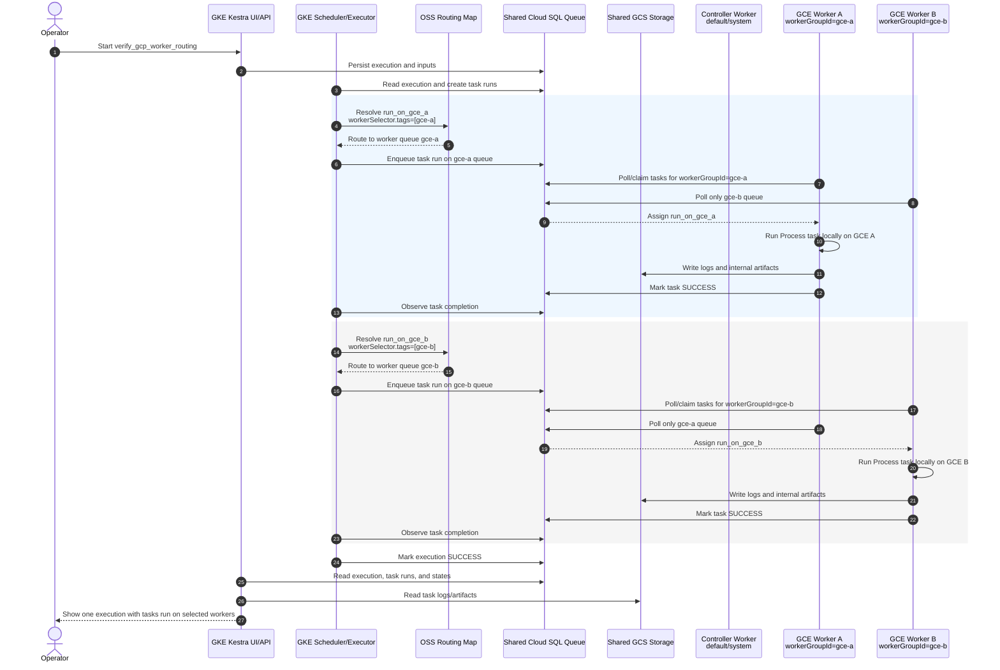

# OSS Worker Routing Sequence

This document explains the custom OSS Kestra fork's worker-routing mechanism with a Mermaid
sequence diagram.

## Overview

The OSS fork is a shared-backend routing model, not Kestra Enterprise Worker Groups. One GKE Kestra
controller observes the execution, while selected worker processes run tasks on GCE or
on-prem-style hosts. Routing happens before worker pickup: `workerSelector.tags` is mapped to a
static worker queue, and only workers with the matching `workerGroupId` consume that queue.

## Kestra Fork

This mechanism depends on the custom Kestra fork at
`https://github.com/tacogips/kestra/tree/feature/oss-worker-routing`.

The repository workflow checks out `tacogips/kestra` at branch `feature/oss-worker-routing`, builds
the custom Kestra executable, installs the GCS, shell, and Kubernetes plugins, and publishes the
result as:

```text
<region>-docker.pkg.dev/<project-id>/kestra-playground/kestra-oss-worker-routing:<tag>
```

The fork adds config-backed static worker routing for OSS deployments. In this repo's live routed
topology, the GKE controller config defines routing queues such as `gce-a` and `gce-b`, while each
external worker starts with `kestra.worker.routing.workerGroupId` set to the group it serves. When a
task declares `workerSelector.tags`, the fork maps those tags to the matching queue before any
worker claims the task. That prevents ordinary load-balancing from sending placement-sensitive work
to the wrong worker.

Upstream `kestra/kestra` should not be used to verify this path. The static
`kestra.worker.routing` queue/group configuration only has routing semantics in the forked image,
and the live shared-backend database schema is tied to the custom `kestra-oss-worker-routing`
runtime image.

## Sequence



## Details

The controller-side routing configuration defines queue tags:

- `gce-a` maps to task selector tag `gce-a`.
- `gce-b` maps to task selector tag `gce-b`.

Each worker process starts with one group identity:

- GCE worker A uses `kestra.worker.routing.workerGroupId: gce-a`.
- GCE worker B uses `kestra.worker.routing.workerGroupId: gce-b`.
- The optional controller worker uses default/system queues for lightweight unrouted control work.

A routed task uses this shape:

```yaml
workerSelector:
  tags: [gce-a]
  match: ALL
  fallback: FAIL
taskRunner:
  type: io.kestra.plugin.core.runner.Process
```

`fallback: FAIL` is important for placement-sensitive work: if the selector cannot be satisfied,
the task should fail instead of silently running on a default worker. `Process` is also important
for shell tasks because it runs the command inside the selected worker container or host. Without
that explicit task runner, script plugin defaults can try Docker execution and fail when the worker
does not mount a Docker socket.

## References

- `design-docs/specs/architecture.md`
- `design-docs/specs/command.md`
- `https://github.com/tacogips/kestra/tree/feature/oss-worker-routing`
- `kestra/flows-worker-routing/verify_gcp_worker_routing.yaml`
- `k8s/base/configmap.yaml`
