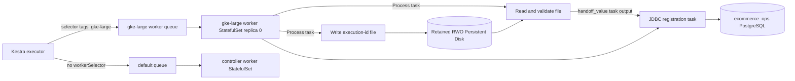

# Stateful Worker Local-File Handoff

## Purpose

This example proves a placement-sensitive batch chain on GKE:

1. An unselected Process task proves ordinary work runs on the default `controller` worker group.
2. A writer task runs on the dedicated `gke-large` worker and creates a worker-local file.
3. A reader task runs on the same worker instance, fails if the file is absent, and emits the read
   value as a Kestra task output.
4. A PostgreSQL task runs on that same worker and registers the emitted value in the batch database.
5. A separate negative execution skips the writer and proves that the reader fails without creating
   a database row.

The live verification is implemented by
`kestra/flows-worker-routing/verify_worker_local_file_handoff.yaml` and
`scripts/verify-live-worker-local-file-handoff.sh`.

## Architecture



The control-plane components, the default worker, and the routed workers are one-replica
StatefulSets. The dedicated worker mounts its retained `ReadWriteOnce` claim at
`/var/lib/kestra-worker-local`; pod `fsGroup: 1000` gives the non-root Kestra process write access.
The writer and reader use the `Process` task runner, so filesystem operations occur inside the
selected worker container rather than in a separate Docker runner.

All three positive-path tasks declare the same selector:

```yaml
workerSelector:
  tags: [gke-large]
  match: ALL
  fallback: WAIT
  broadcast: false
```

`gke-large` has one replica. `broadcast: false` creates one task run rather than one copy per group
member, and `fallback: WAIT` prevents execution on the default worker if the dedicated worker is
temporarily unavailable. The verifier additionally compares the writer, reader, and JDBC task-run
worker IDs and matches that ID against the `gke-large` worker connection log.

## Default Queue Contract

An ordinary task with no `workerSelector` does not enter a routed queue. In this deployment, the
worker group named `controller` is the default worker group and subscribes only to the reserved
`default` and `system` queues:

```yaml
groupQueueMappings:
  controller:
    queues:
      - workerQueueId: default
      - workerQueueId: system
```

The dedicated `gke-small` and `gke-large` groups subscribe only to their same-named queues. The
handoff live verifier first runs a Process task without a selector and proves its worker ID belongs
to `workerGroup=controller`. It then proves the three selected task IDs belong to the same
`workerGroup=gke-large` member. The verifier also checks the live controller mapping contains
exactly `default` and `system`. Therefore an unselected runnable task is consumed by the default
worker, not a dedicated routed worker. System tasks continue to use the reserved `system` queue.

## GKE Verification Result

GitHub Actions run
[`32925099023`](https://github.com/tacogips/kestra-playground/actions/runs/32925099023)
completed successfully on 2026-08-26 after deploying commit `0c3d01f`:

- Full StatefulSet scale-to-zero and cold-start recovery passed while retaining the PostgreSQL PVC.
- Category execution `72SIwDTFrbXvC2L8uYav0h` ran the unselected task on worker
  `eBDdhaG2pTKcChNC3yL4r` and the selected task on worker `2pF5IpCL2z3iUjIoRg9xFK`.
- Handoff execution `7g3gEvgeBgNIz33Ks8Q40C` ran its writer and reader on worker
  `2pF5IpCL2z3iUjIoRg9xFK` and read `orders-ready-7g3gEvgeBgNIz33Ks8Q40C`.
- Negative execution `3ZRDPoAvTl7Q4TDiToU41U` failed as expected when the file was absent.

That run predates the JDBC registration task. The workflow must be rerun after this document's
change, and its result recorded here, before database registration is considered live-verified.

## Guarantees and Limits

- "Same server" means the same Kestra worker process/StatefulSet member, proven by identical task
  worker IDs. It does not mean a permanently fixed Kubernetes node.
- The retained RWO Persistent Disk follows StatefulSet replica `0` if GKE reschedules the pod, so
  the handoff survives pod replacement. Node-ephemeral disk semantics would require explicit node
  pinning and are intentionally not used here.
- One replica per placement-sensitive worker group is required for deterministic local-file
  affinity. Scaling `gke-large` above one replica would require a stronger affinity key or shared
  storage.
- Worker-local files are application handoff data only. Kestra execution state remains in
  PostgreSQL and internal artifacts remain in GCS.

## Reproduce

Run the complete routed deployment and verification:

```bash
gh workflow run deploy.yml \
  --ref main \
  -f target_environment=routed \
  -f run_batch=false \
  -f operation_demo=none
```

The workflow runs routing, file, database, category, and optional operation checks before the slow
full-stack scale-to-zero/cold-start verification. This keeps functional failures visible early
while preserving the lifecycle test as the final gate.

For an already deployed matching revision, run
`mise run kestra:live:run-category-batch-image-routing` and
`mise run kestra:live:run-worker-local-file-handoff`.
